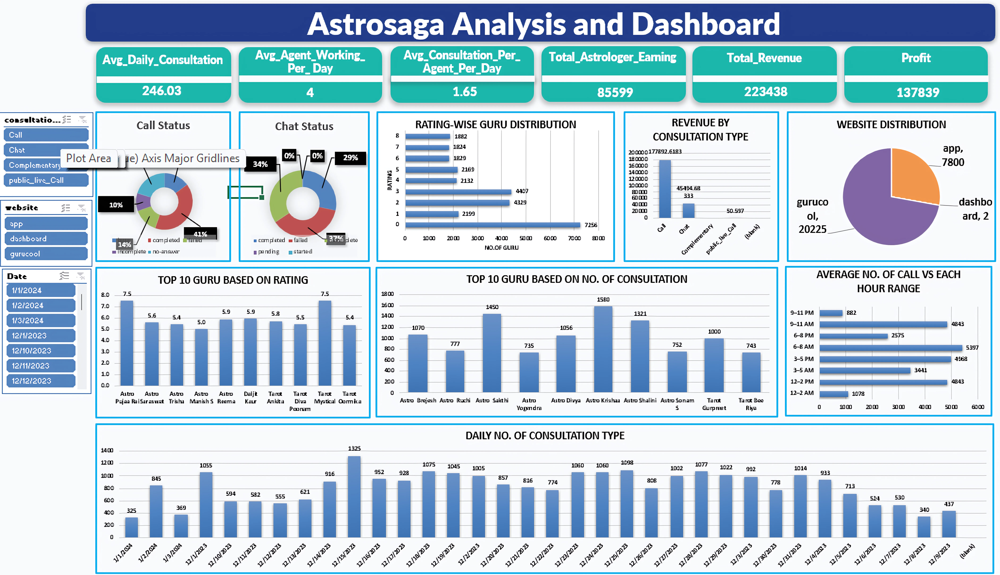

# Astrosaga Call Center Analysis 📊

This project presents a **comprehensive analysis of Astrosaga’s call center operations**, focusing on agent productivity, consultation patterns, and revenue insights. Using **Microsoft Excel (Pivot Tables, Charts, and Dashboarding techniques)**, I built an interactive dashboard that transforms raw data into actionable business intelligence.

---

## 🚀 Project Overview
The goal of this project is to analyze call center data and highlight:
- Daily consultations and average consultations per agent
- Agent working hours and productivity
- Guru performance (ratings and consultation volume)
- Revenue distribution by consultation type
- Website traffic breakdown
- Call patterns by time of day

---

## 📊 Dashboard Preview
Here’s the Excel dashboard created in this project:

---

## 🔑 Key Features
- **KPI Tracking**: Daily consultations, agent performance, and total earnings  
- **Revenue Insights**: Analysis by call, chat, and other consultation types  
- **Performance Rankings**: Top gurus based on ratings and consultation volume  
- **Call Trends**: Hourly distribution of calls for staffing optimization  
- **Visualization**: Interactive Excel dashboard with charts and slicers  

---

## 🛠 Tools & Skills Used
- **Microsoft Excel**  
  - Pivot Tables  
  - Pivot Charts  
  - Slicers & Filters  
  - Dashboard Design  
- Data Cleaning & Preparation  
- Data Visualization & Storytelling  

---

## 📈 Insights Gained
- Identified **peak consultation hours** to optimize resource allocation  
- Highlighted **top-performing gurus** driving consultations and revenue  
- Revealed **consultation type contributions** to overall earnings  

---

## ✅ Outcome
The **Astrosaga Call Center Analysis Dashboard** demonstrates how Excel can be used to uncover insights and make data-driven business decisions from call center data.

---

## 🤝 Acknowledgments
Special thanks to **Newton School** for mentorship and guidance throughout this project.

)

